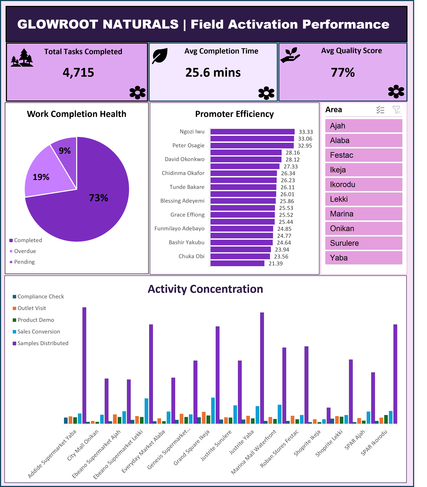

# GlowRoot Naturals — Field Activation Performance Dashboard

## 📌 Project Overview
GlowRoot Naturals is a skincare and haircare brand running in-store promoter campaigns across retail outlets in Lagos, Nigeria. This project transforms raw field activity logs into an interactive, executive-ready Excel dashboard designed for weekly trade marketing performance reviews.

---

## 📊 Key Dashboard Metrics
* **Total Tasks Completed:** 4,715 tasks logged across 10 regions
* **Average Completion Time:** 25.6 minutes per task
* **Average Field Quality Score:** 77.3% overall rating

---

## 📸 Dashboard Showcase

---

## 🛠️ Tools & Key Features
* **Tool:** Microsoft Excel
* **Data Structuring:** Range-to-Table conversion, data type validation, text trimming/standardization.
* **PivotTables & Charts:** 
  * *Activity Concentration:* Clustered Column Chart tracking task volume by outlet and task type.
  * *Promoter Efficiency:* Horizontal Bar Chart analyzing execution time gaps across promoters.
  * *Work Completion Health:* Donut Chart displaying task status breakdown (Completed vs. Overdue vs. Pending).
* **Interactivity:** Single-page layout with a connected **Area Slicer** filtering all visuals dynamically.

---

## 🚀 How to View
Download `PAULINA ADEDOKUN.xlsx` to explore the full interactive workbook and connected slicer functionality.
